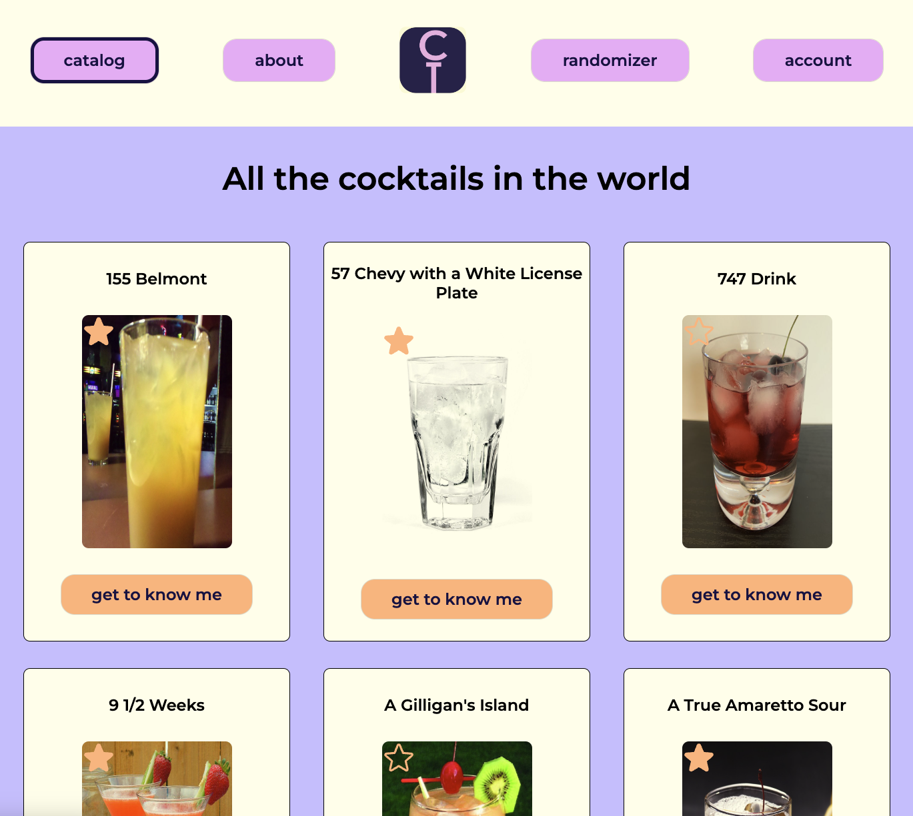

# Installatiehandleiding CocktailTalks

## Inhoudsopgave
1. Inleiding
2. Eindresultaat
3. Lijst van benodigdheden
4. Applicatie pre-check
5. Applicatie starten
6. Applicatie sluiten

## Inleiding
Deze applicatie is gebouwd om antwoord te geven op een aantal vragen die menig cocktailliefhebber heeft.
En naar mijn mening bestaat er nog geen mooie oplossing waarbij alle antwoorden voor die vragen krijgt.
Vanuit die gedachte is CocktailTalks ontstaan. Hierbij een greep uit de vragen met daarbij een functionaliteit die een vraag beantwoord:
1. Als je niet zo goed weet welke cocktail je nu eens zou moeten proberen, dan bied de Randomizer pagina de oplossing. Deze genereert met een druk op de knop een leuk voorstel.
2. Benieuwd naar welke cocktails er eigenlijk zijn. Daarvoor is de cataloguspagina, deze pagina biedt een overzicht naar een groot aanbod in cocktails.
3. Wil je toch je favoriete cocktails bijhouden en hierover feedback bijschrijven. Klik dan op het sterretje bij je gekozen cocktail en die wordt dan toegevoegd aan je account. Op je account pagina kan je vervolgens feedback schrijven en opslaan.

## Eindresultaat
#### Hierbij een screenshot van een gevulde account pagina met feedback:


#### Hierbij een screenshot van de Randomizer pagina:


#### Hierbij een screenshot van de catalogus pagina:



## Benodigdheden.
Om deze applicatie te gebruiken zijn de volgende zaken nodig. 
- Github project: https://github.com/Bernardthe3rd/cocktailtalks
- Basis URI voor API requests: https://api.datavortex.nl/cocktailtalks
- API key = cocktailtalks:JmnVqzgJyhYDbqyQauOT 
- Node.js 
- Runtime enviroment: Google Chrome 
- Gebruikte (npm) dependencies:
   1. _**Axios**_, zorgt ervoor dat je diverse requests richting de cocktail API kan doen.
   2. _**react-router-dom**_, zorgt er in deze applicatie voor dat routing toegepast kan worden. M.a.w. dat de navigatie op een logische manier in de applicatie zit.
   3. _**jwt-decode**_, gebruik je om de originele token van een gebruiker te decoderen. Om deze vervolgens te gebruiken om bijvoorbeeld gebruikersinfo op te halen.
   4. _**@phosphor-icons/react**_, is een icon package. Het ster icon komt hiervandaan en nog een ander icoontje, als je die kan vinden!
- Inloggegevens van al bestaande accounts:
   1. username/email = benjaminmeijer1@gmail.com , password: BenjaminMeijer
   2. username/email = hello@hello.com , password: hello123
   3. username/email = goodbye@hello.com , password: goodbye123

## Applicatie pre-check
Clone dit project naar jouw lokale IDE. Nadat je dit project hebt gecloned, via version control, en succesvol geopend is, controleer je of je node.js op je apparaat geïnstalleerd is.

Dit doe je door middel van het volgende commando te runnen in de terminal:
```shell
node -v
```
Als hier een versienummer, bijvoorbeeld v13.9.3, uitkomt dan is Node aanwezig. (Dit kan een versienummer hoger zijn)

Vervolgens voer je het volgende commando om te checken of NPM ook geïnstalleerd is:
```shell
npm -v
```
Als hier een versienummer, bijvoorbeeld 6.4.1, uitkomt dan is NPM aanwezig. (Dit kan ook een versienummer hoger zijn)

**_Mocht een van beide niet aanwezig zijn dan is node niet (juist) geïnstalleerd. Zoek node.js in je browser op en download node.js._**

## Applicatie starten
Zijn bovenstaande stappen gelukt, installeer dan alle dependencies door het volgende commando in de terminal te runnen:
```shell 
npm install
```
Wanneer dit klaar is, kan je in de zojuist toegevoegde node_modules map controleren of de dependencies uit het vorige hoofdstuk geïnstalleerd zijn.
Als dat allemaal klopt, kan je de applicatie starten door het volgende commando in de terminal te runnen:
```shell
npm run dev
```

Open dan je runtime environment, bij voorkeur google chrome, en ga dan naar de url die in de terminal achter het kopje local verschenen is.
Die zal er ongeveer zo uit zien: `https://localhost:5173/` het nummer kan variëren.

### _Geniet van de applicatie!_

## Applicatie sluiten
Mocht je klaar zijn met de applicatie sluit dan simpelweg je runtime environment en sluit het tabblad van de terminal
waar je npm run dev had getypt. Je IDE zal misschien vragen of je zeker bent dat je de applicatie wilt sluiten en kies je voor ja. In webstorm klik je dan op 'terminate'. 